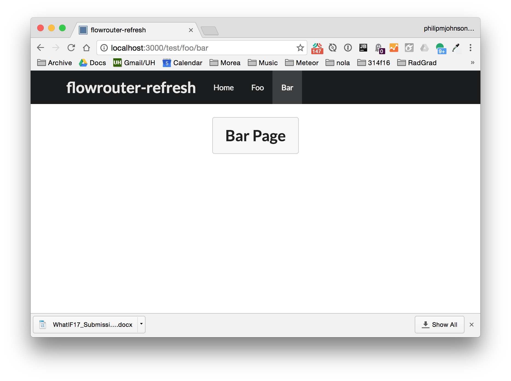

# flowrouter-refresh

RadGrad has a problem (at least in the admin section) where refreshing a subpage (admin/datamodel) takes you to another page (/admin). 

I created this sample system to illustrate the problem, but refresh works just fine in this simple system. So, there's something else going on in RadGrad.

To run this system:

```
$ cd app/
$ meteor npm install
$ meteor run
```

Here's what the bar page looks like. Refreshing keeps you on that same page, which is not what RadGrad currently does in similar circumstances. You may want to look at [router.js](https://github.com/philipmjohnson/flowrouter-refresh/blob/master/app/imports/startup/client/router.js).


